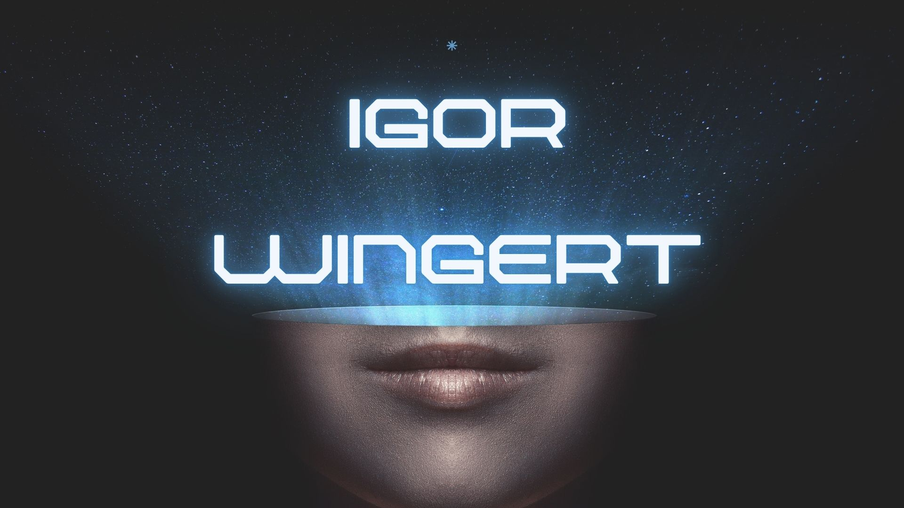

<h1 align="center">Olá! Eu sou o Igor👋</h1>

  

  Estudante de Ciência da Computação • Analista de Redes Pleno • Ciência de Dados

  
  
  

---

## 🚀 Sobre mim

Sou estudante de **Ciência da Computação** e atuo como **Analista de Redes Pleno**, com experiência em infraestrutura, monitoramento, troubleshooting e análise de tráfego de rede.

Atualmente, estou direcionando minha carreira para a área de **Ciência de Dados**, com foco em **NetFlow, observabilidade, telemetria e análise de dados aplicada a redes**.

Tenho interesse em transformar dados de rede em insights úteis para operação, segurança e tomada de decisão.

---

## 🎯 Objetivos atuais

- Aprofundar conhecimentos em **Ciência de Dados**
- Aplicar análise de dados ao contexto de **redes e telecom**
- Trabalhar com **NetFlow, logs, monitoramento e observabilidade**
- Construir projetos que unam **infraestrutura + dados**

---

## 🛠️ Tecnologias e ferramentas

### Redes, Infraestrutura e Monitoramento

  
  
  
  
  
  
  
  
  
  
  
  

### Dados e Programação

  
  
  
  
  
  
  
  

### Machine Learning e Ciência de Dados

  
  
  
  
  

---

## 📌 Projetos em destaque

vou adicionar ainda :D

---

## 📫 Contato

- LinkedIn: https://www.linkedin.com/in/igor-wingert-0885a8288
- Email: igwingert@gmail.com
